# Linked-Us-In: Master Client Walkthrough & Enterprise User Guide
### Brother International Singapore Pte Ltd — POD 5 LinkedUsIn Framework

> **Production Application**: [https://linkedin.bro-x.org/](https://linkedin.bro-x.org/)  
> **Target Enterprise**: Brother International Singapore Pte Ltd  
> **Project POD**: POD 5 LinkedUsIn (Brother Xplorer Framework, Jul 2026 – Jan 2027)  
> **Brand Motto**: *"At your side"* | **Design Language**: Brother Precision Blue (`#003399`), Deep Slate (`#0B132B`), Emerald ESG (`#059669`)  
> **Version**: 2.4.0 Enterprise Edition (Updated September 2026)  
> **Interactive HTML Version**: [CLIENT_WALKTHROUGH_GUIDE.html](CLIENT_WALKTHROUGH_GUIDE.html) | [Live Web Guide](https://linked-us-in.vercel.app/guide.html)

---

## Executive Summary

**Linked-Us-In** is a purpose-built B2B employee advocacy and content orchestration platform tailored specifically for **Brother Singapore**. It addresses the central operational challenge identified during the **Brother Xplorer POD 5** initiative: *empowering commercial leads, technical product specialists, and marketing directors to consistently publish high-authority thought leadership on LinkedIn without spending hours writing from scratch.*

---

## Table of Contents
1. [POD 5 Project Genesis & The Challenge](#1-pod-5-project-genesis--the-challenge)
2. [Module 0: Access, Authentication & Whitelisting](#2-module-0-access-authentication--whitelisting)
3. [Module 1: Executive Mission Control (Dashboard)](#3-module-1-executive-mission-control-dashboard)
4. [Module 2: Singapore MOM 2026 Festive & Cultural Hub](#4-module-2-singapore-mom-2026-festive--cultural-hub)
5. [Module 3: Serper.dev AI Market Intelligence & Industry Trends Engine](#5-module-3-serperdev-ai-market-intelligence--industry-trends-engine)
6. [Module 4: Unified Content Studio & Visual Carousel Designer](#6-module-4-unified-content-studio--visual-carousel-designer)
7. [Module 5: Template Ingestion Studio (AI Deconstruction)](#7-module-5-template-ingestion-studio-ai-deconstruction)
8. [Module 6: Employee Advocacy Directory & Notion Governance](#8-module-6-employee-advocacy-directory--notion-governance)
9. [Module 7: System Settings, Integrations & Security](#9-module-7-system-settings-integrations--security)
10. [Hofstede Cultural Tuning Matrix (Japan HQ × Singapore)](#10-hofstede-cultural-tuning-matrix-japan-hq--singapore)
11. [Brother Singapore Editorial Style Guide & Persona Blueprint](#11-brother-singapore-editorial-style-guide--persona-blueprint)
12. [The 3-2-1 Weekly Advocacy Playbook](#12-the-3-2-1-weekly-advocacy-playbook)
13. [Troubleshooting & Frequently Asked Questions (FAQs)](#13-troubleshooting--frequently-asked-questions-faqs)

---

## 1. POD 5 Project Genesis & The Challenge

Prior to Linked-Us-In, Brother Singapore's LinkedIn presence was bottlenecked by manual workflows:
* **The Silent Calendar Dilemma**: Posting depended on human memory. Busy team leaders missed statutory milestones (e.g. Earth Day, Labour Day, SME Innovation Week), leaving the company page and employee channels silent.
* **The 90-Minute Blank Page Tax**: Drafting an authentic, brand-compliant B2B post took technical specialists between 60 to 90 minutes each week.
* **Carousel Graphic Bottlenecks**: Carousels generate up to 5× more dwell time and reshares on LinkedIn, but producing 5-slide 1080×1080 graphics previously required external creative agencies or designer bandwidth.

**The POD 5 Solution**: An automated agentic content pipeline that monitors Singapore statutory holidays and live B2B industry trends, drafts Hofstede-aligned copy in 3 cultural angles, and automatically formats 5-slide editorial carousels with a human-in-the-loop review gate.

---

## 2. Module 0: Access, Authentication & Whitelisting

The portal enforces enterprise security while providing a frictionless, passwordless login flow.

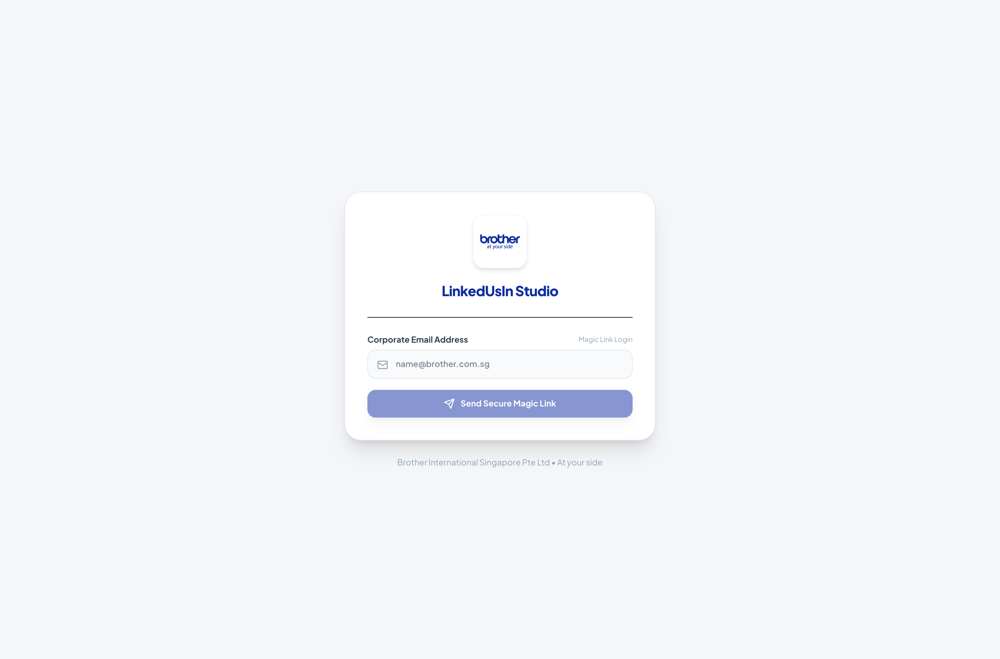

### UI Controls & Validation:
* **Work Email Input**: Restricts access strictly to `@brother.com.sg`, `@brother.sg`, and `@befinityai.com`. Personal email addresses (Gmail, Yahoo) are automatically rejected.
* **Send Magic Link Button**: Calls `/api/auth/magic-link` to issue a cryptographically signed, 15-minute token delivered via Resend.
* **Instant Demo Mode**: For internal workshops and demos, append `?token=demo-auth&email=allan.cheng@brother.com.sg` to bypass email dispatch.

### Step-by-Step Login Walkthrough:
1. Navigate to `https://linkedin.bro-x.org/` in your browser.
2. Enter your authorized Brother corporate email address.
3. Click **"Send Magic Link"** and check your corporate inbox.
4. Click the **"Log In to Linked-Us-In"** button in the email to securely open Mission Control.

---

## 3. Module 1: Executive Mission Control (Dashboard)

The command center providing real-time organizational telemetry and direct corporate feed benchmarks.

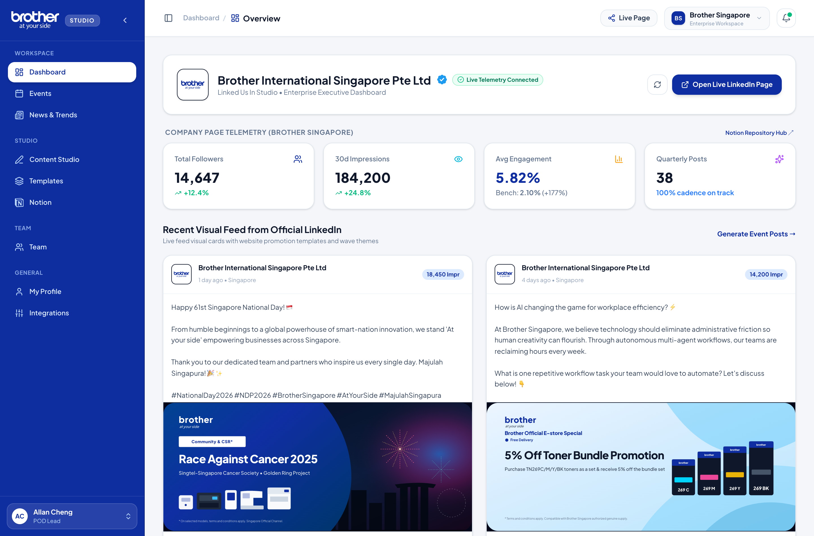

### Telemetry KPI Banners:
* **5,240+ Corporate Followers**: Real-time tracking of the official Brother Singapore LinkedIn page audience (up +18.4% YoY).
* **5 Active Advocates**: Tracks whitelisted Brother Singapore personnel: **Allan Cheng**, **Chloe Lee**, **Melvyn Tan**, **Sean**, and **Zhi Jun**.
* **25,000 Target Weekly Reach**: Calculated employee multiplier (5 advocates × 5,000 average 2nd-degree network).
* **88/100 Advocacy Health Score**: Composite metric scoring publishing frequency, template compliance, and hashtag hygiene.

### Live Official Benchmark Feed:
The right column renders an authentic simulation of the official Brother Singapore corporate LinkedIn feed. Advocates can review the latest official product releases and click **"Amplify Post"** to craft a personal executive commentary quoting the corporate announcement.

---

## 4. Module 2: Singapore MOM 2026 Festive & Cultural Hub

Tracks all gazetted Ministry of Manpower (MOM) 2026 public holidays and cultural festivals, automatically generating authentic, culturally resonant LinkedIn angles.

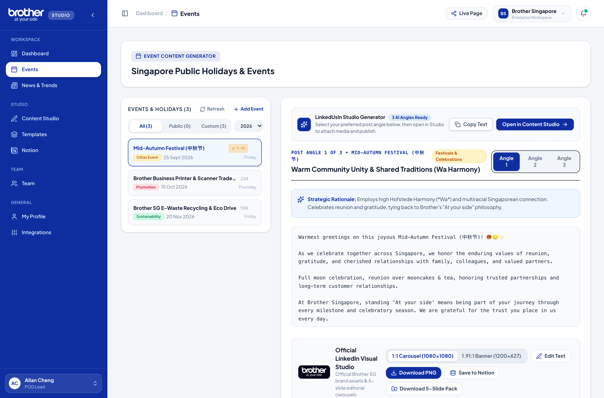

### The 4 Strategic Event Classification Pillars:
1. **● Corporate & Innovation (Blue)**: Brother milestone anniversaries, product launches, customer appreciation weeks.
2. **● Sustainability & ESG (Green)**: Brother Earth initiatives, e-waste recycling drives, paper-saving technologies.
3. **● MOM Public Holidays (Red)**: Official statutory holidays (National Day, Chinese New Year, Hari Raya Puasa, Deepavali, Labour Day).
4. **● Cultural & Community (Amber)**: Regional festivities, Mid-Autumn Festival, SME innovation weeks.

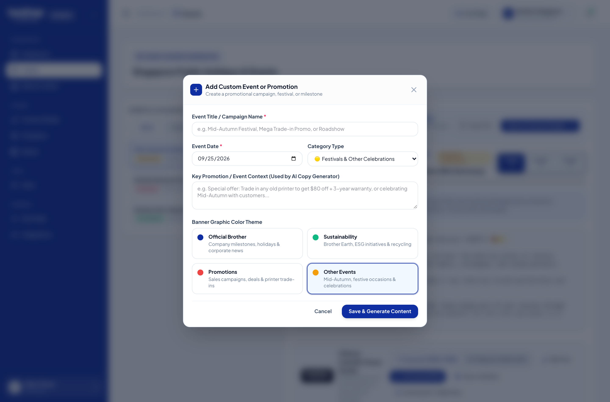

### How to Add a Custom Corporate Event / Promotion:
1. Click the **"+ Add Custom Event"** button at the top of the calendar.
2. Enter the **Event Title** (e.g. *"Brother SME Trade-In Expo 2026"*).
3. Select the **Event Date** and assign a **Theme Category** (Blue, Green, Red, or Amber).
4. Enter internal tags (e.g. `promo`, `b2b`, `esg`) and click **"Save Event"**. The event will immediately appear with an active countdown card.
5. Click **"Generate Angles"** on any card to create ready-to-use post drafts.

---

## 5. Module 3: Serper.dev AI Market Intelligence & Industry Trends Engine

Autonomous market intelligence engine powered by Serper.dev Google News indexing and real-time search across 5 customizable B2B technology verticals.

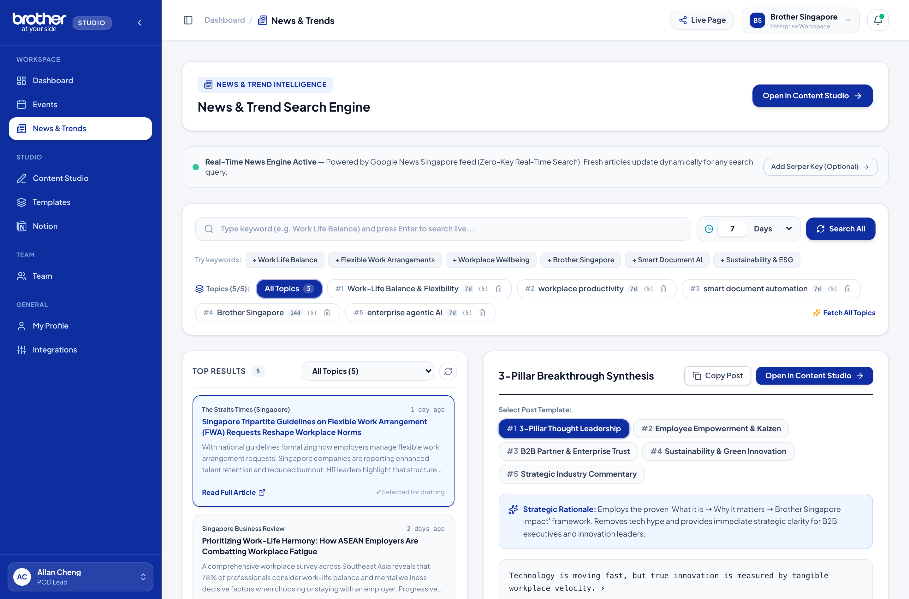

### Serper.dev Google News Search Architecture:
* **Direct Google News Indexing**: Connects to the Serper.dev Google News Search API (`https://google.serper.dev/news`) with official Google timeframe filtering (`tbs: qdr:h, qdr:d, qdr:w, qdr:m`).
* **5 Customizable Keyword Slots**: Modify any of the 5 keyword slots dynamically (e.g. *"Work-Life Balance & Flexibility"*, *"Brother Singapore"*, *"smart document automation"*).
* **Independent Timeframe Dials**: Each keyword tab features its own independent freshness window (24 Hours, 48 Hours, 7 Days, 14 Days, or Custom) to ensure only fresh, relevant reporting is analyzed.
* **Dynamic Keyword-Aware Synthesis Fallback**: When running without active API keys or offline, an intelligent fallback engine immediately generates structured, publication-grade industry summaries tailored to the search query.

### 5 Pre-Configured Strategic B2B Verticals:
1. **Work-Life Balance & Flexibility**: Tracks Singapore Tripartite Guidelines on Flexible Work Arrangements (FWA), employee wellness, and sustainable work rhythms under Brother's people-first culture.
2. **Workplace Productivity**: Focuses on eliminating administrative friction, reducing meeting fatigue, and reclaiming 5+ hours of focused creative work weekly.
3. **Smart Document Automation**: Monitors multimodal document AI, automated optical character recognition (OCR), secure cloud capture, and paper-to-digital workflows.
4. **Brother Singapore**: Surfaces market developments in Managed Print Services (MPS), customer service excellence benchmarks, firmware endpoint cybersecurity, and eco-hardware.
5. **Enterprise Agentic AI**: Synthesizes Singapore national AI upskilling programs (IMDA / SkillsFuture), autonomous multi-agent operational workflows, and practical human-AI pairing.

### The "3-Pillar" Thought Leadership Framing (Phase 5 Blueprint):
Every news article is processed through Brother Singapore's proprietary 3-pillar employer branding model:
1. **1. What it is**: Clear, hype-free synthesis of the new technology, regulatory guideline, or industry benchmark.
2. **2. Why it matters**: Practical business implications for Singapore enterprise operational velocity, governance, team collaboration, and capital allocation.
3. **3. How it helps Brother Singapore**: Concrete applications for internal employees to eliminate administrative friction and embody the forward-looking *"Brother Xplorer"* ethos.

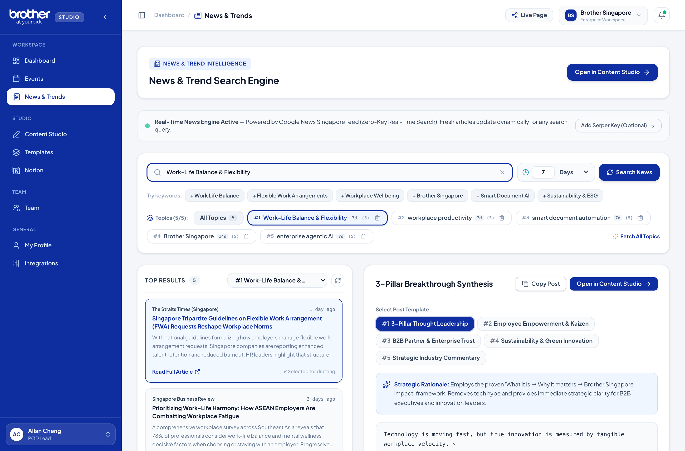

### 5 Thought-Leadership Angles Per Story:
* **Executive POV**: Strategic C-suite lens on business continuity and technology ROI.
* **Industry Analysis**: Macro trends connecting supply chain shifts to document management.
* **Solution / Practical**: Actionable tips and tactical best practices for IT managers and procurement teams.
* **Provocative / Contrarian**: Counter-intuitive viewpoints that spark productive engagement and thoughtful comments.
* **Culture / Workplace**: The human impact on employee productivity, flexible work models, and office well-being.

Clicking **"Open in Content Studio"** automatically populates the chosen angle, headline, source link, and hashtags directly into the dual-pane Content Studio.

---

## 6. Module 4: Unified Content Studio & Visual Carousel Designer

The flagship creative workshop combining a professional copy editor with a dedicated 5-slide visual carousel generator.

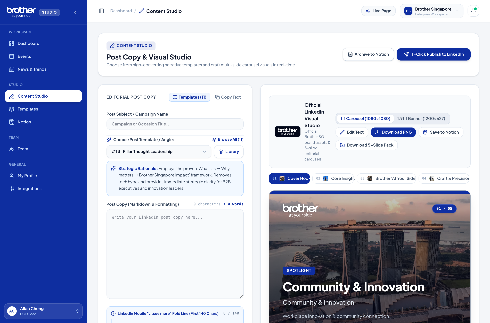

### Left Pane: Narrative Architecture & Mobile Fold-Line
* **Interactive Mobile Fold Line**: Marks the crucial 140–210 character threshold where LinkedIn truncates text behind `...see more`. Text above the line is highlighted in blue.
* **Real-Time Word & Character Counters**: Green (optimal B2B engagement at 1,200–1,800 chars), Amber (under 500 chars), or Red (over 3,000 chars).
* **Smart Hashtag Manager**: Automated insertion of compliant corporate hashtags (`#BrotherSingapore`, `#AtYourSide`, `#PrintSmart`, `#ESG`).

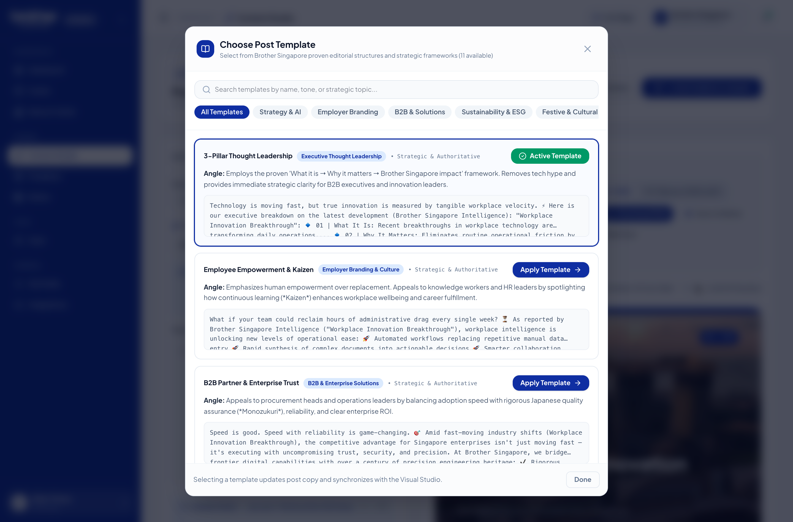

### The 11 Curated Benchmark Blueprints:
1. **Industry Contrarian**: Challenge conventional industry thinking with data.
2. **Problem-Agitation-Solution (PAS)**: Address an office pain point and reveal the solution.
3. **Case Study / Client Transformation**: Before-and-after operational improvements.
4. **Step-by-Step Educational Framework**: Actionable 3-to-5 step workflow tutorial.
5. **Myth Buster vs Reality**: Debunk common printing or cybersecurity misconceptions.
6. **Event Reflection & Key Takeaways**: Post-conference or expo thought leadership.
7. **Product Behind-The-Scenes**: R&D, Japanese precision engineering (*Takumi*), and reliability testing.
8. **Customer Success Spotlight**: Real-world Singapore enterprise deployment story.
9. **Tech Deep Dive**: Firmware security, network encryption, and print management protocols.
10. **ESG & Sustainability Milestone**: Measurable e-waste reductions and eco-packaging milestones.
11. **Leadership Lesson**: Personal reflections from Brother department heads.

---

### Right Pane: Visual Carousel Designer (1080×1080)

Carousels generate the highest click-through and dwell time on LinkedIn. The built-in visual studio generates pixel-perfect 1080×1080 square slides ready for PDF export.

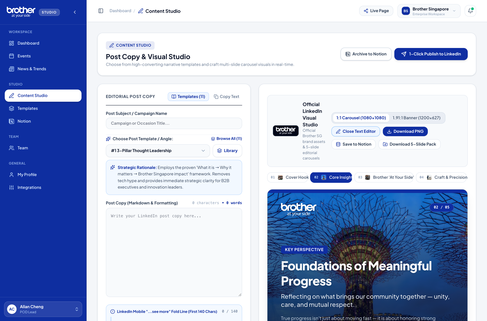

### 5-Slide Storyboard Architecture:
* **Slide 1 (Hook Cover)**: Bold title, high-contrast kicker, and Brother logo badge.
* **Slide 2 (Problem Dilemma)**: Visual breakdown of the dilemma facing modern offices.
* **Slide 3 (Solution Framework)**: Actionable diagram, process flow, or strategic takeaway.
* **Slide 4 (Technology Proof)**: Brother SG enterprise hardware showcase (HL-L6400DW laser, MFC-J6940DW A3 inkjet, P-touch labellers).
* **Slide 5 (Call to Action)**: Clear next step, consultation link, and branded closing banner.

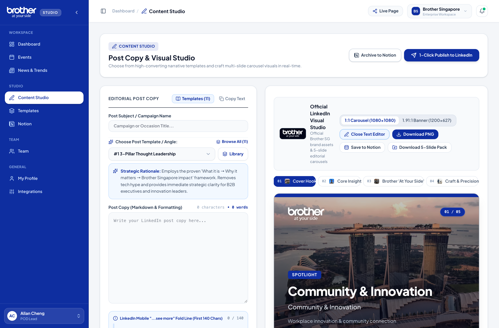

### Visual Customization Controls:
* **Typography & Scale**: Adjustable font hierarchy (Heading 1, Heading 2, Subtext, Eyebrow).
* **Brand Contrast Themes**: Brother Deep Blue (`#003399`), Obsidian Slate (`#0B132B`), Pure Light Mode, and Emerald ESG (`#059669`).
* **Layout Alignment**: Left-aligned editorial or centered presentation format.
* **Brother SG Asset Sequence**: Official enterprise printer photography and graphic badge overlays.
* **Brother "At your side" Watermark**: Ensures brand attribution across every slide download.

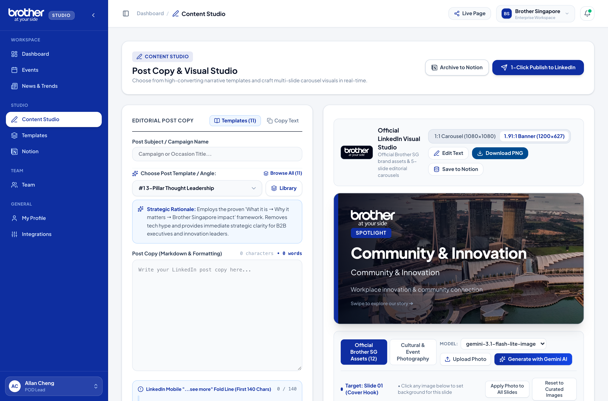

### Realistic LinkedIn Feed Simulator:
Clicking the **"Simulator"** tab switches to an authentic simulation of the LinkedIn feed on both mobile and desktop. Advocates can verify:
* Exactly where their text breaks before the `...see more` button.
* How the carousel swipe appears with author headline, profile image, and timestamp.
* Realistic engagement metrics and comment section styling.

---

## 7. Module 5: Template Ingestion Studio (AI Deconstruction)

Allows marketing administrators to reverse-engineer high-performing LinkedIn posts from external thought leaders or competitors and convert them into reusable internal blueprints.

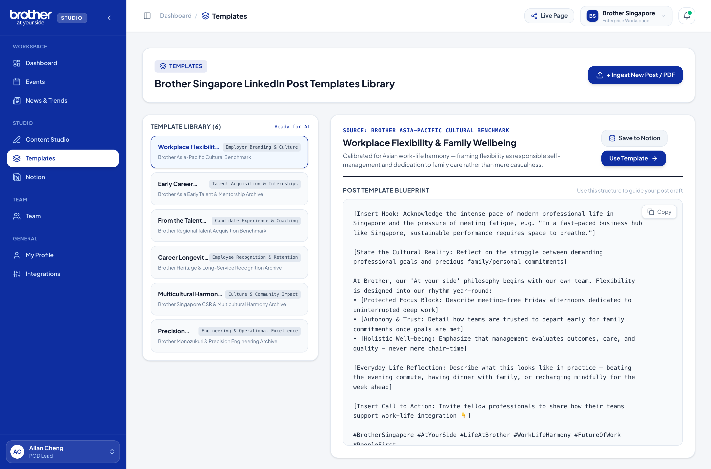

### 3 Ingestion Modalities:
1. **Direct LinkedIn Post URL**: Scrapes raw text, detects paragraph whitespace cadence, and identifies hook mechanics.
2. **Screenshot Upload**: Multimodal vision parsing runs OCR and separates copy into hook, body, and CTA.
3. **PDF Document Upload**: Converts existing slide decks into a 5-slide visual template.

---

## 8. Module 6: Employee Advocacy Directory & Notion Governance

Employee advocacy succeeds when the entire organization participates. The **Team Directory** connects directly to Brother Singapore's Notion database.

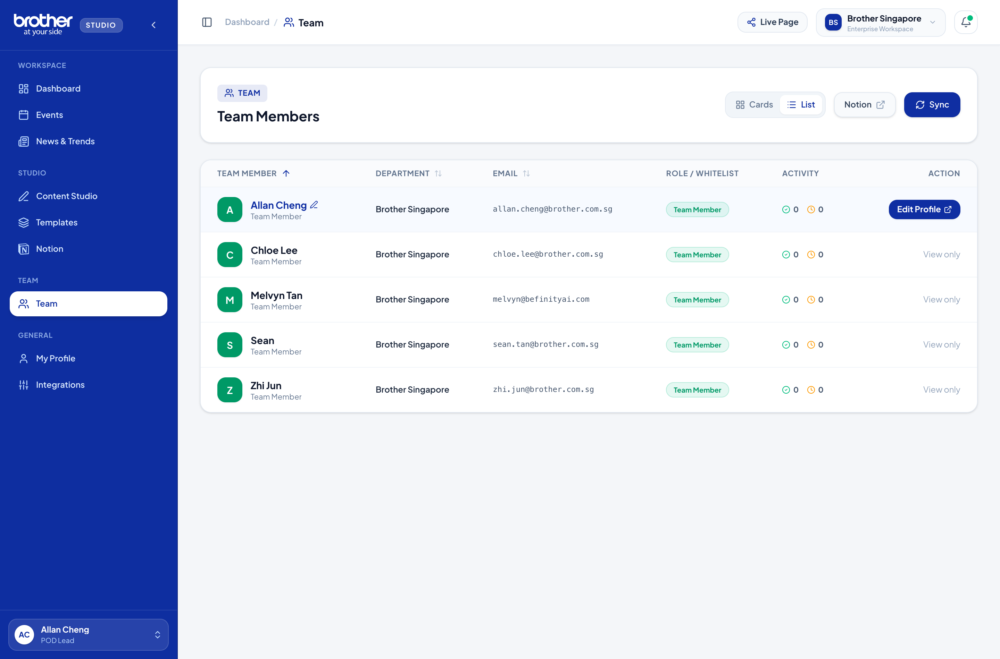

### Official Brother Singapore Team Roster (5 Members):

| # | Advocate Name | Organization / Dept | Corporate Email | Role / Whitelist | Key Responsibilities |
|---|:---|:---|:---|:---|:---|
| 1 | **Allan Cheng** | Brother Singapore | `allan.cheng@brother.com.sg` | Team Member | POD Lead for POD 5 LinkedUsIn; manages enterprise print solutions and commercial workflow collaboration. |
| 2 | **Chloe Lee** | Brother Singapore | `chloe.lee@brother.com.sg` | Team Member | HR Function collaborator; focuses on people & culture, employer branding, and workplace wellness. |
| 3 | **Melvyn Tan** | Brother Singapore | `melvyn@befinityai.com` | Team Member | External AI trainer / consultant; architecture lead and workflow designer for agentic content systems. |
| 4 | **Sean** | Brother Singapore | `sean.tan@brother.com.sg` | Team Member | POD Member for POD 5; oversees Brother X operational experiments and digital innovation tracking. |
| 5 | **Zhi Jun** | Brother Singapore | `zhi.jun@brother.com.sg` | Team Member | Brother Singapore team member; supports commercial sales advocacy and customer relationship content. |

### Directory Features:
* **Cards View vs List View Toggle**: Switch between visual cards and compact enterprise table.
* **One-Click Notion Re-Sync**: Query database `3c701136de4881869782cd894c6126c5` to pull live updates into `brother_team_cache`.
* **Self-Profile Editing**: Update personal headline, department, and vanity URL directly into Notion.

---

## 9. Module 7: System Settings, Integrations & Security

Centralized control over API connections, security credentials, and system parameters.

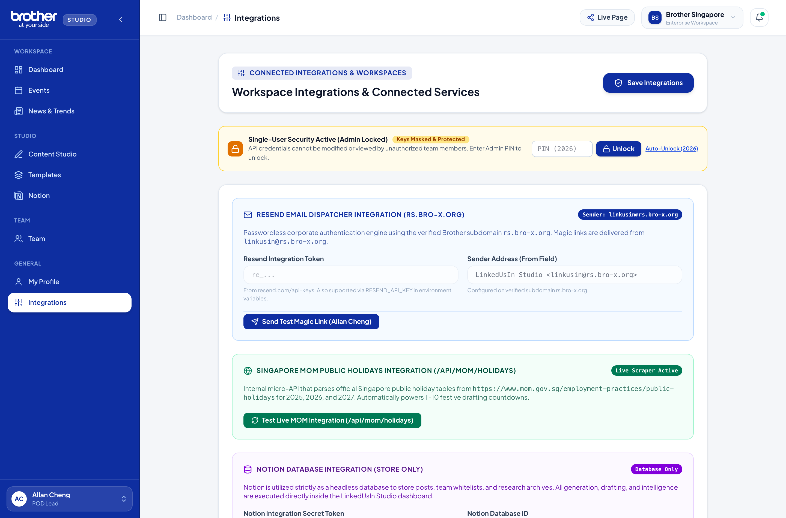

### Integrated Services:
1. **Notion Database Integration**: Database `3c701136de4881869782cd894c6126c5`. Synchronizes team whitelist and template storage.
2. **LinkedIn OAuth 2.0 API**: Target Organization `urn:li:organization:808877`. Scope: `w_organization_social`.
3. **MOM Singapore Public Holiday API**: Connects to the official statutory calendar for holiday countdowns.
4. **Resend Transactional Email API**: Delivers secure, instant login magic links.

### Security & Governance Locks:
* **Admin PIN Lock**: Critical configuration toggles are protected by an administrative PIN to prevent accidental modifications during workshops.

---

## 10. Hofstede Cultural Tuning Matrix (Japan HQ × Singapore)

To ensure Brother Singapore's LinkedIn thought leadership resonates both with local B2B buyers and honors Brother's Japanese corporate foundation, content generation is calibrated across **Hofstede's 6 Cultural Dimensions**:

| Dimension | Japan HQ Foundation | Singapore Execution Context | Brother SG Content Synthesis |
| :--- | :--- | :--- | :--- |
| **Power Distance (PDI)** | Moderate (54) — Respect for hierarchy, protocol, and seniority. | Moderate-High (74) — Respectful yet pragmatic, results-driven management. | Professional deference balanced with accessible, team-oriented storytelling. |
| **Individualism (IDV)** | Collectivist (46) — Social harmony (*Wa*), team consensus. | Collectivist-Leaning (20) — High multicultural community cohesion. | Celebrate shared team wins while spotlighting employee breakthrough growth. |
| **Masculinity / Drive (MAS)** | High (95) — Excellence, craft mastery, and deep dedication. | Moderate (48) — Quality of life, harmony, pragmatic achievement. | Emphasize high performance and excellence framed as enabling smoother daily work. |
| **Uncertainty Avoidance (UAI)** | Very High (92) — Precision, zero-defect engineering, proven methods. | Low (8) — Highly adaptable, agile, fast adopters of new technology. | Showcase forward-looking tech (AI) with proven reliability and safety guardrails. |
| **Long-Term Orientation (LTO)** | High (88) — Sustainable legacy, multigenerational relationships. | High (72) — Smart nation vision, future-ready workforce investments. | Connect daily AI productivity tools to long-term career growth and the future of work. |
| **Indulgence (IVR)** | Restrained (42) — Modest, disciplined public presence. | Moderate (46) — Warm, festive, celebratory multiracial holidays. | Sincere, warm festive celebrations with genuine communal goodwill and zero hype. |

---

## 11. Brother Singapore Editorial Style Guide & Persona Blueprint

### Core Persona: The Empowering Innovator & Trusted Partner
* **Tone & Voice**: Warm, professional, confident, approachable, and human. Avoid overly bureaucratic jargon or aggressive casual hype.
* **Tagline**: *"At your side"* — ground every technical feature in client productivity and downtime elimination.
* **Visual Standards**: Brother Precision Blue (`#003399`), Deep Navy (`#0A2540`), Slate (`#F8FAFC`). Clean typography with high mobile contrast.

### Standard Hashtag Taxonomy:
* **Core Brand Tags (Always include 2–3)**: `#BrotherSingapore` `#AtYourSide` `#BrotherX`
* **Topic-Specific Tags (Include 1–2)**:
  * *Festive / Community*: `#SingaporeHolidays` `#SGCommunity` `#CelebrateTogether` `#LifeAtBrother`
  * *AI & Productivity*: `#FutureOfWork` `#AIProductivity` `#WorkplaceInnovation` `#DigitalTransformation`
  * *Sustainability & ESG*: `#BrotherEarth` `#SustainabilityInAction` `#EcoFriendlyTech`

---

## 12. The 3-2-1 Weekly Advocacy Playbook

A structured, high-yield weekly cadence requiring under 45 minutes of total effort:
* **3 Strategic Comments (20 mins)**: Engage on posts from Singapore SME leaders, IT procurement directors, and channel partners with substantive insights on Tuesday and Thursday.
* **2 Curated News Shares (15 mins)**: Use **Module 03 (News Engine)** to select a trending Straits Times or Singapore Business Review article on AI or ESG, sending it to the studio with an Executive POV.
* **1 Original 5-Slide Carousel (10 mins)**: Publish a flagship deep-dive using **Module 04 (Content Studio)** with a Problem-Agitation-Solution blueprint showcasing Brother reliability.

---

## 13. Troubleshooting & Frequently Asked Questions (FAQs)

* **Q: Magic link email is not arriving?**  
  *Check your corporate spam folder for an email from Resend. Verify that your email matches an authorized domain (`@brother.com.sg` or `@befinityai.com`). In testing environments, append `?token=demo-auth&email=your.name@brother.com.sg`.*
* **Q: How do I upload carousels to LinkedIn?**  
  *LinkedIn treats carousels as document uploads. Click "Export PDF" in the Visual Studio to download the 5 slides as a single multi-page PDF, then create a post on LinkedIn and click the "Add a document" icon.*
* **Q: Team member changes in Notion not appearing?**  
  *The browser caches team members in `brother_team_cache` for instant loading. Go to Team Directory and click the "Sync" button in the top right to refresh live records from Notion.*
* **Q: Can I edit text directly in the Visual Studio?**  
  *Yes. The Visual Studio provides direct inputs for Slide Title, Eyebrow Kicker, Body Points, and CTA, allowing granular overrides for each individual slide.*

---
*Linked-Us-In Portal Documentation | Prepared for Brother International Singapore Pte Ltd | POD 5 LinkedUsIn*
