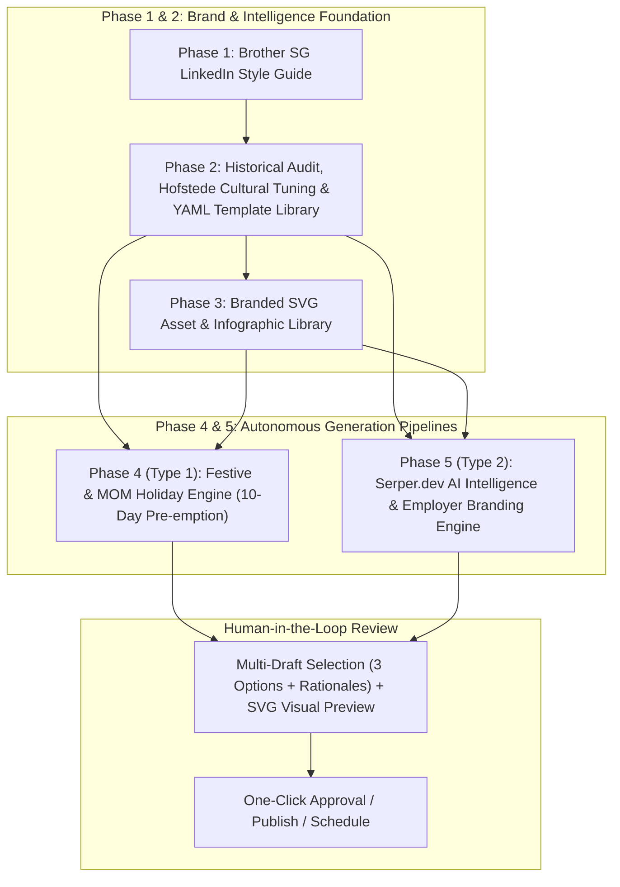

# POD 5: LinkedUsIn — Phased Build & Architecture Blueprint

## Executive Summary
**LinkedUsIn** is an agentic content generation and intelligence platform tailored for **Brother Singapore**. It streamlines LinkedIn brand presence across two distinct pillars:
1. **Pillar 1 (Cultural & Festive):** Timely, automated festive and public holiday posts triggered via official MOM calendar data at least 10 days in advance.
2. **Pillar 2 (Employer Branding & Innovation):** Thought leadership and employer branding posts generated by an active AI intelligence engine tracking the latest AI/technology breakthroughs and translating them into productivity gains for Brother Singapore employees.

---

## 🏗️ 5-Phase Build Breakdown

---

### **Phase 1: Brother Singapore LinkedIn Style Guide & Persona Blueprint**
**Objective:** Define the definitive editorial standard, voice, and guardrails for Brother Singapore's LinkedIn presence.

* **1.1 Core Brand Voice Definition:**
  * Define tone attributes: Professional, innovative, approachable, empowering, customer-centric ("At your side").
  * Distinguish regional Singapore voice from global Brother corporate tone.
* **1.2 Structural & Formatting Guidelines:**
  * Hook formulas, paragraph spacing, readability (short punchy sentences, bullet points).
  * Strategic emoji usage (restrained, purposeful vs overused).
  * Standardized call-to-action (CTA) frameworks and hashtag taxonomies (`#BrotherSingapore`, `#AtYourSide`, `#BrotherX`, `#WorkplaceInnovation`).
* **1.3 Guardrails & Compliance:**
  * Tone sensitivity rules, HR compliance, copyright, and confidentiality checks.
* **Deliverable:** `docs/style_guide_brother_sg.md` (Referenced across all prompt pipelines).

---

### **Phase 2: Historical Post Audit, Hofstede Cultural Tuning & YAML Template Library**
**Objective:** Analyze past content, inject cultural nuances, vet with human stakeholders, and build a modular YAML-driven template library with multi-draft generation logic.

* **2.1 Historical Post Audit & Improvement Recommendations:**
  * Ingest historical Brother Singapore LinkedIn posts.
  * Evaluate engagement metrics, hooks, framing, and visual consistency.
* **2.2 Cultural Framing using Hofstede Dimensions (Japan × Singapore):**
  * **Power Distance & Hierarchy:** Balancing Japanese corporate respect/craftsmanship with Singapore's fast-paced, pragmatic business ecosystem.
  * **Collectivism vs. Individualism:** Celebrating team harmony (*Wa*) and shared milestones while acknowledging individual employee achievements.
  * **Uncertainty Avoidance & Quality Assurance:** Emphasizing reliability, precision engineering, and customer trust.
  * **Long-Term Orientation & Innovation:** Showcasing sustainable progress and digital transformation (Brother Xplorer mindset).
* **2.3 Human-in-the-Loop Review & Vetting:**
  * Interactive review session with Allan, Sean, and Chloe (HR) to approve recommendations.
* **2.4 Modular YAML Template Library:**
  * Build categorized templates (Festive, Milestones, Tech/AI Innovation, CSR/ESG, Employee Spotlight).
  * Structured YAML frontmatter containing metadata: category, target audience, tone, hook style, structure rules, and asset recommendations.
* **2.5 Multi-Draft Generation Engine (3 Angles + Explanations):**
  * AI engine evaluates incoming occasion/news, selects top matching templates, and generates **up to 3 distinct drafts** accompanied by an explicit reasoning breakdown ("Why this angle works").
* **Deliverable:** `templates/` directory with standardized `.md` files featuring rich YAML frontmatter and evaluation prompt chains.

---

### **Phase 3: Branded SVG Asset & Infographic Library**
**Objective:** Build a scalable, parametric SVG generation library to produce high-resolution, on-brand social cards and infographics.

* **3.1 Design System & Identity Standards:**
  * **Color Palette:** Primary Brother Blue (`#005BAC`), supporting corporate tones (navy, slate, white, accent cyan/gold for festive highlights).
  * **Typography & Hierarchy:** Font pairing rules (modern sans-serif, high-contrast headers, legible caption weights).
  * **Visual Elements:** Geometric grid systems, clean iconography, badges, subtle Japanese geometric motifs (Kumiko-inspired accents where appropriate), festive stickers, and branded footer overlays.
* **3.2 Parametric SVG Template Categories:**
  * *Template A: Festive / Greeting Card* (Seasonal backdrop, headline, festive emblem, Brother logo).
  * *Template B: 3-Stage Innovation Infographic* ("What it is", "Why it matters", "Productivity impact").
  * *Template C: Stat / Quote Card* (Employee spotlight or metric achievement).
* **3.3 Image Rendering & Export Engine:**
  * Code-to-SVG dynamic text insertion engine with automatic text wrapping and dynamic contrast calculation.
* **Deliverable:** `assets/svg_templates/` library and automated SVG rendering helper.

---

### **Phase 4: Post Stream 1 — Festive & MOM Holiday Engine (10-Day Pre-emption)**
**Objective:** Automatically track Singapore public holidays and cultural occasions, pre-empting the review team at least 10 days before the date.

* **4.1 Ministry of Manpower (MOM) Scraper & Cultural Calendar Ingest:**
  * Automated crawler/feed fetching the official Singapore MOM Public Holidays gazette (Hari Raya Puasa / Haji, Chinese New Year, Deepavali, National Day, Good Friday, Vesak Day, Labour Day, Christmas, New Year).
  * Supplemental cultural & global awareness calendar (Earth Day, International Women's Day, World Environment Day).
* **4.2 10-Day Advance Trigger Scheduler:**
  * Cron/Scheduler checks the upcoming 30-day window daily.
  * When an occasion is $T-10$ days away, it triggers draft creation automatically.
* **4.3 Generation & Pairing Pipeline:**
  * Pulls from Phase 2 YAML Festive Templates and Phase 3 Festive SVG assets.
  * Outputs 3 ready-to-review draft variants + companion visual in the HR review dashboard.
* **Deliverable:** Autonomous calendar crawler, trigger daemon, and automated festive post workflow.

---

### **Phase 5: Post Stream 2 — AI Intelligence & Employer Branding Engine (Serper.dev)**
**Objective:** Build an autonomous market intelligence agent curating the latest AI trends and drafting employer branding thought leadership.

* **5.1 Serper.dev Integration & Real-Time Monitoring:**
  * Ingest real-time search queries targeting AI breakthroughs, enterprise automation, generative AI tools, and workplace productivity (time-restricted to past 24 hours).
  * Configurable controls: Target keywords, result depth ($N$), and alert frequency caps (up to 7 alerts/posts per week).
* **5.2 "3-Pillar" Thought Leadership Framing:**
  * Automated transformation of raw tech news into Brother Singapore employer branding narrative:
    1. **What it is:** Clear, hype-free synthesis of the new technology/model.
    2. **Why it matters:** Implications for enterprise efficiency, collaboration, and modern business.
    3. **How it helps Brother Singapore:** Practical application for internal employees to unlock breakthrough productivity and embody the "Brother Xplorer" ethos.
* **5.3 Companion Infographic Auto-Generation:**
  * Dynamically populates the 3-Stage Innovation SVG template with generated bullet points.
* **5.4 Notification & Review Queue:**
  * Dispatches notification with the 3 draft options and infographic preview to Allan / Chloe for single-click review.
* **Deliverable:** Serper API integration module, 3-pillar narrative synthesizer, and automated review pipeline.

---

## 📊 Summary of Phase Deliverables & Tech Stack

| Phase | Core Deliverable | Key Components |
|---|---|---|
| **Phase 1** | Brother SG Style Guide | Tone of voice, formatting rules, hook formulas, hashtags |
| **Phase 2** | YAML Template Library & Post Audit | Hofstede Japan-SG analysis, 3-draft multi-generator with rationales |
| **Phase 3** | SVG Visual Asset Library | Parametric SVG templates, brand color system, infographics |
| **Phase 4** | MOM Holiday Engine | MOM holiday scraper, $T-10$ day proactive alert scheduler |
| **Phase 5** | AI Intelligence Engine | Serper.dev 24h search, 3-pillar narrative framework, auto-infographics |
